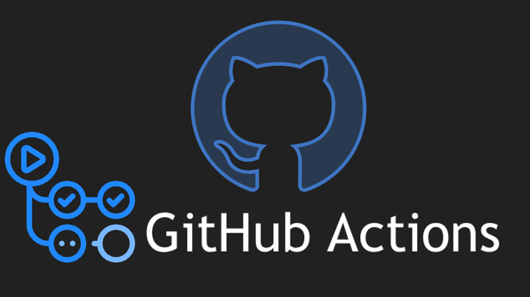

<h1 align="center">
  
  <br>
</h1>

# Criando a Aplicação
Uma função de soma simples em go.<br>
`math.go`
```
package main

import "fmt"

func main() {
	fmt.Println(soma(112, 10))
}

func soma(a int, b int) int {
	return a + b
}
```
Essa parte faz uma verificação em busca de erro.<br>
`math_test.go`
```
package main

import "testing"

func TestSoma(t *testing.T) {

	total := soma(15, 15)

	if total != 30 {
		t.Errorf("Resultado da some é inválido: Resultado %d. Esperado: %d", total, 30)
	}
}
```
# Criar o repositório
Crair o repositório.
```
git init 
git branch -M main
  # ...
```
Com os arquivo da api pronto, cria uma pasta `.github/workflow` contendo o arquivo `ci.yaml`, neste arquivo vai ter as configurações para testar a aplicação.<br>
* No arquivo contém as instruções para rodar a aplicação em uma máquina Ubuntu e 
testar o código Go.<br>

`ci.yaml`
```
name: ci-golang-workflow
on: [push]
jobs:
  check-application:
    runs-on: ubuntu-latest
    steps:
      - uses: actions/checkout@v2
      - uses: actions/setup-go@v2
        with:
          go-version: 1.15
      - run: go test
      - run: go run math.go
```
Quando enviar os novos arquivos junto com o `ci.yaml`, o GitHub Actions vai testar o código.
* Ajustar as configurações para as regras e proteções as branchs.

# Ajustando o Código
Todas as vezes que subir algo para a branch develop o código vai ser testado.<br>
`ci.yaml`
```
name: ci-golang-workflow
on: 
  pull_request:
    branches: 
      - develop
jobs:
  check-application:
    runs-on: ubuntu-latest
    steps:
      - uses: actions/checkout@v2
      - uses: actions/setup-go@v2
        with:
          go-version: 1.15
      - run: go test
      - run: go run math.go
```
